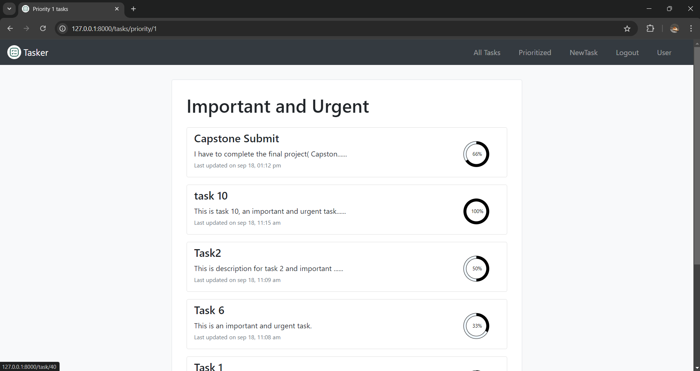

# Tasker Task Management App

## 📖 Overview

"Tasker" is a task management app designed to prioritize tasks and track their progress. Unlike other task management apps, Tasker focuses on simplifying task prioritization and progress tracking.

## 🎯 Features

- **Task Creation**: Create tasks with subtasks to break down large tasks into manageable chunks.
- **Task Prioritization**: Categorize and prioritize tasks based on importance and urgency.
- **Mobile Responsive**: Fully responsive design for mobile devices.
- **Dynamic Forms**: Add or remove subtasks dynamically in the task creation form.
- **Asynchronous Operations**: Handle form submissions and updates without page reloads.
- **Progress Tracking**: Visualize task progress with circular progress bars.
- **User Profile**: View user details and task statistics.

## 🎥 Demo Video

[Capstone Project Demo](https://youtu.be/tPgiXyVhU0U)


## ⚙️ Distinctiveness and Complexity

### Distinctiveness

Tasker stands out from other projects in the course due to its unique features:

- **Task Management**: Different from commerce, network, or wiki projects.
- **Advanced Features**: Includes tasks, subtasks, prioritization, and dynamic form fields.
- **Asynchronous JavaScript**: Utilizes asynchronous JavaScript for dynamic page updates.

### Complexity

Tasker is more complex than other projects due to extensive JavaScript usage:

- **Dynamic Forms**: Add or remove subtasks dynamically with JavaScript.
- **Asynchronous Form Submission**: Handle form submissions without page reloads.
- **Dynamic Task Display**: Render task lists and progress bars dynamically using JavaScript and API fetch calls.

## 📂 File Contents

### Static Files

- **`styles.css`**: CSS styling for the entire app.
- **`index.js`**: Displays tasks on the index page with circular progress bars and pagination.
- **`show_priority_tasks.js`**: Similar to `index.js` but for priority tasks.
- **`show_task.js`**: Handles API fetch calls for task updates.
- **`new_task.js`**: Manages dynamic subtask fields and asynchronous form submission.

### HTML Templates

- **`layout.html`**: Base layout with a navbar.
- **`index.html`**: Home page showing all tasks for the logged-in user.
- **`register.html`**: User registration form.
- **`login.html`**: User login form.
- **`new_task.html`**: Form for creating new tasks.
- **`priority_matrix.html`**: Displays the priority matrix.
- **`profile.html`**: User profile page.
- **`show_task.html`**: Displays task details.
- **`show_priority_tasks.html`**: Shows tasks with a specific priority.

### Python Files

- **`views.py`**: Contains HTML template views and API views.
- **`models.py`**: Defines database models for User, Task, and Subtask.

## ▶️ How to Run the App

### Download the Project Code

1. Clone the repository:

    ```bash
    git clone https://github.com/me50/varunpenumudi.git
    ```

2. Navigate to the repository folder:

    ```bash
    cd varunpenumudi
    ```

3. Switch to the project branch:

    ```bash
    git checkout web50/projects/2020/x/capstone
    ```

### Migrate and Run the App

1. Migrate the models:

    ```bash
    python manage.py migrate
    ```

2. Apply migrations to the database:

    ```bash
    python manage.py makemigrations
    ```

3. Start the server:

    ```bash
    python manage.py runserver
    ```

## 📱 App Features

- **Add New Task**: Click the "New Task" link in the navbar to add a new task.

    

- **Task Previews**: View task previews on the index page with titles, descriptions, and progress bars.

    

- **Task Details**: Click a task preview to view its details.

    

- **Edit Task**: Edit task descriptions, change priorities, add/delete subtasks, and update progress dynamically.

    

- **Priority Matrix**: View the priority matrix to see tasks categorized by priority.

    

- **Priority Tasks**: Click a priority box to view tasks with that priority.

    

- **User Profile**: View user details and task statistics.

    

- **Mobile Responsive**: The app is fully responsive for mobile devices.

    
